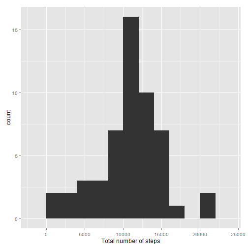

# Reproducible Research: Peer Assessment 1


## Loading and preprocessing the data

```r
echo=TRUE ## Code always visible
scipen=1
Sys.setlocale("LC_TIME", "English")
```

```
## [1] "English_United States.1252"
```

```r
data<-read.csv("activity.csv")
str(data)
```

```
## 'data.frame':	17568 obs. of  3 variables:
##  $ steps   : int  NA NA NA NA NA NA NA NA NA NA ...
##  $ date    : Factor w/ 61 levels "2012-10-01","2012-10-02",..: 1 1 1 1 1 1 1 1 1 1 ...
##  $ interval: int  0 5 10 15 20 25 30 35 40 45 ...
```

```r
head(data)
```

```
##   steps       date interval
## 1    NA 2012-10-01        0
## 2    NA 2012-10-01        5
## 3    NA 2012-10-01       10
## 4    NA 2012-10-01       15
## 5    NA 2012-10-01       20
## 6    NA 2012-10-01       25
```

```r
library(ggplot2)
```

## What is mean total number of steps taken per day?
- Calculate the total number of steps taken per day

```r
sumSteps<-aggregate(steps~date,data=data, FUN=sum, na.rm=TRUE)
```
- Make a histogram of the total number of steps taken each day and calculate and report the mean and median of the total number of steps taken per day

```r
qplot(steps,data=sumSteps,binwidth=2000)+xlab("Total number of steps")
```

 


```r
mean(sumSteps$steps,na.rm=TRUE)
```

```
## [1] 10766.19
```


```r
median(sumSteps$steps,na.rm=TRUE)
```

```
## [1] 10765
```

## What is the average daily activity pattern?
- Make a time series plot of the 5-minute interval (x-axis) and the average number of steps taken, averaged across all days and show the 5-minute interval which contains the maximun number of steps

```r
avgSteps<-aggregate(steps~interval,data=data,mean,na.rm=TRUE)
names(avgSteps)[2] <- "meanOfSteps"
g <- ggplot(avgSteps, aes(x = interval, y =meanOfSteps))
g + geom_line()+xlab("5-minute interval")+ylab("number of steps taken (average)")
```

 


```r
avgSteps[which.max( avgSteps[,2] ),]
```

```
##     interval meanOfSteps
## 104      835    206.1698
```

## Imputing missing values
- Calculate and report the total number of missing values in the dataset

```r
sum(is.na(data$steps))
```

```
## [1] 2304
```
- Devise a strategy for filling in all the missing values in the dataset: I use the mean for 5-minute interval as strategy for filling missing values
- Create a new dataset that is equal to the original dataset but with the missing data filled in.

```r
data2<-data 
for(i in 1:nrow(data2)){
        if(is.na(data2$steps[i])){
        data2$steps[i]<-avgSteps[which(data2$interval[i]==avgSteps$interval),]$meanOfSteps
        }
}
sum(is.na(data2))
```

```
## [1] 0
```

```r
head(data2)
```

```
##       steps       date interval
## 1 1.7169811 2012-10-01        0
## 2 0.3396226 2012-10-01        5
## 3 0.1320755 2012-10-01       10
## 4 0.1509434 2012-10-01       15
## 5 0.0754717 2012-10-01       20
## 6 2.0943396 2012-10-01       25
```
- Make a histogram of the total number of steps taken each day and Calculate and report the mean and median total number of steps taken per day

```r
sumSteps2<-aggregate(steps~date,data=data2, FUN=sum)
qplot(steps,data=sumSteps2,binwidth=2000)+xlab("Total number of steps")
```

 


```r
mean(sumSteps2$steps)
```

```
## [1] 10766.19
```

```r
median(sumSteps2$steps)
```

```
## [1] 10766.19
```
- Do this values differ from the estimates from the first part of the assigment?

```r
meanSteps<-c(mean(sumSteps$steps),mean(sumSteps2$steps),(mean(sumSteps$steps)-mean(sumSteps2$steps)))
medianSteps<-c(median(sumSteps$steps),median(sumSteps2$steps),(median(sumSteps$steps)-median(sumSteps2$steps)))
x<-rbind(meanSteps,medianSteps)
colnames(x)<-c("Old value","New value","Difference")
x
```

```
##             Old value New value Difference
## meanSteps    10766.19  10766.19   0.000000
## medianSteps  10765.00  10766.19  -1.188679
```
After imputing the missing data, the new mean of total steps is the same as the old mean and the new median of total steps is sligthly lower than the old median.So, the impact of imputting missing data on the estimates of the of the total daily number of steps is practically none.

## Are there differences in activity patterns between weekdays and weekends?
- Create a new factor variable in the dataset with two levels - "weekday" and "weekend" indicating wheter a given data is a weekday or weekend day.

```r
dateTime<-paste(as.Date(data2$date),data2$Time)
data2$DateTime<-as.POSIXct(dateTime)
data2$wkday<-weekdays(data2$DateTime)
data2$weekdays[data2$wkday==c("Saturday","Sunday")]<-"Weekend"
data2$weekdays[data2$wkday!=c("Saturday","Sunday")]<-"Weekday"
head(data2)
```

```
##       steps       date interval   DateTime  wkday weekdays
## 1 1.7169811 2012-10-01        0 2012-10-01 Monday  Weekday
## 2 0.3396226 2012-10-01        5 2012-10-01 Monday  Weekday
## 3 0.1320755 2012-10-01       10 2012-10-01 Monday  Weekday
## 4 0.1509434 2012-10-01       15 2012-10-01 Monday  Weekday
## 5 0.0754717 2012-10-01       20 2012-10-01 Monday  Weekday
## 6 2.0943396 2012-10-01       25 2012-10-01 Monday  Weekday
```
- Make a panel plot containing a time series plot of the 5-minute interval (x-axis) and the average number of steps taken, averaged across all weekday days or weekend days (y-axis)

```r
avgSteps2<-aggregate(data2$steps,
                     list(interval=as.numeric(as.character(data2$interval)),
                          weekdays=data2$weekdays),
                     FUN="mean")
names(avgSteps2)[3]<-"meanOfSteps"
g <- ggplot(avgSteps2, aes(x = interval, y =meanOfSteps))
g + geom_line()+xlab("5-minute interval")+ylab("number of steps taken (average)")+facet_grid(weekdays~.)
```

 
